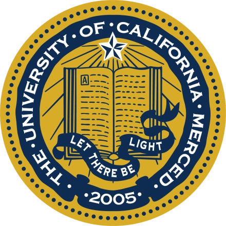

I’m currently a junior student studying in Information Science Advanced Class, school
of Electronic Information & Communication, HUST. I have a great interest in many aspects in Artificial Intelligence, especially computer vision related tasks.

Now I am a visiting student at VlLab@UCMerced, supervised by Prof. [Ming-Hsuan Yang](https://faculty.ucmerced.edu/mhyang/), also working closely with [Lu Qi](http://luqi.info/) and [Xueting Li](https://research.nvidia.com/person/xueting-li), working on 3D/4D generation.
Previously, I am very fortunate to be supervised by Prof. [Xinggang Wang](https://xwcv.github.io/)@HUSTVL, Prof. [Meng Tang](mengtang.org)@mengtang lab, UCMerced.

If you are interested in working with me or want to have a chat, please send me an email directly. Always welcome!

- Expected to be seeking for Ph.D. positions in 2025 Fall!

**Research Interest**
======

- Artificial Intelligence, Computer Vision, Multi-modality

- data-efficient learning, General visual intelligence

- Generative-related, 3D/4D generation ...

Always open for interesting topics!

**News**
======
- **2024/3/30**: I will join [VLLab@UCMerced](http://vllab.ucmerced.edu/) as a summer intern undergraduate student, supervised by Prof. [Ming-Husan Yang](https://faculty.ucmerced.edu/mhyang/). Looking forward to achieve something impressive!
  
- **2024/2/22**: Our work [WeakSAM](https://arxiv.org/abs/2402.14812) is now available on Arxiv, please check the full paper and refer to our open-sourced codes for more details.

**Education**
======

* 2021 Sep. - 2025 Jun.(expected):

  B.E. in Electronic Information Engineering

  Huazhong University of Science & Technology

**Research & Working experiences**
======

* 2024 May. - Present.: 
  * UCMerced VLLab -- Summer Intern
  * The University of California, Merced
  * Supervisor: Ming-Hsuan Yang

<!-- * Content: 
  * General Visual Intelligence
  * Feature Enginnering
  * text-to-video generation
  

* 2024 May. - Present.:
  * Google research -- Research Assistant
  * Content:
    * Please also refer to above
    * Google Cloud TRC support
  * (joint with summer intern) -->

* 2022 Oct. - 2024 May.: 
  * [HUSTVL](https://github.com/hustvl) -- Research Intern
  * Huazhong Univeristy of Science & Technology
  * Content: 
    * General Visual Intelligence
    * Feature Enginnering
    * Vision-Language
    * Unsupervised Learning
  * Supervisor: Xinggang Wang

* 2023 Dec. - 2024 Mar.:
  * Mengtang Lab -- Research Intern
  * The Univerisity of California, Merced
  * Content: 
    * Diffusion for perception
    * Efficient Structural design
    * Post refinement for generative models
  * Supervisor: Meng Tang
  

**Publications**
======
  <ul>
    
  </ul>

  \* stands for equal contribution